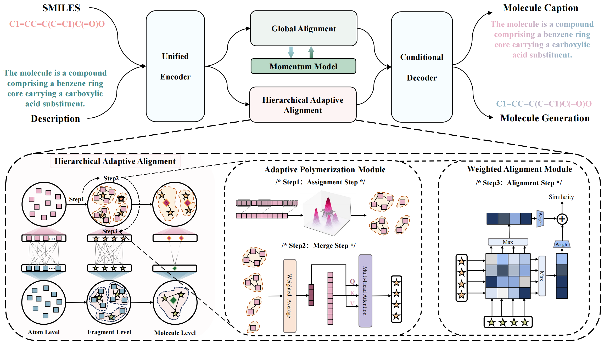

# Hierarchical Adaptive Alignment on Molecule-Text for Unified Molecule Understanding and Generation


We propose Atomas, a hierarchical molecular representation learning framework that jointly learns representations from SMILES strings and text. We design a Hierarchical Adaptive Alignment model to automatically learn the fine-grained fragment correspondence between two modalities and align these representations at three semantic levels. 
Atomas's end-to-end training framework supports understanding and generating molecule, enabling a wider range of downstream tasks. Extensive experiments on retrieval and generation tasks demonstrate superior performance, highlighting the efficacy of our method. Scaling experiments reveal Atomas’s robustness and scalability. Additionally, the visualization and qualitative analysis of Atomas confirms the chemical significance of our approach.

## Requirements

To install requirements:

```setup
pip install -r requirements.txt
```


## Training

To train the model(s) in the paper, run this command:

```train
python main.py --project Atomas --data_dir <your data path> --dataset <choose pubchem or chebi-20 dataset> --model_size <choose base or large> --task <choose genmol or gentext>
```


## Evaluation

To evaluate model, run:

```eval
python eval.py --resume_from_checkpoint mymodel.ckpt 
```

## Pre-trained Models

You can download pretrained models here:

- [Atomas model](https://drive.google.com/file/d/1i4v7b4ZdOnOHJ5hWBFENxmdwaPp8HYBW/view?usp=drive_link) pre-trained on PubchemSTM-distill dataset and finetune on CHEBI-20 dataset for molecule generation task. 
- Due to the model size(~13G), we will release the weights for retrieval and molecule caption tasks upon acceptance.

## Results

### Performance comparison on molecule-text retrieval task:


### Performance comparison on text-based de novo molecule generation:

**Quantitative Results:**


**Qualitative Analysis:**
Atomas can successfully generates the "2-hydroxy-AMP" structure, highlighting the importance of hierarchical alignment in capturing relationships between molecular substructures and textual fragments.


### Performance comparison on molecule captioning task:

**Quantitative Results:**


**Qualitative Analysis:**
Atomas generates more accurate and detailed molecule descriptions, demonstrating the effectiveness of hierarchical alignment models. 


## Visualization


The process of atom (word) polymerization to form individual sets is illustrated at three levels, including the reference diagram, from left to right. Atoms (words) belonging to the same set are highlighted using the same color. 

This molecule is formed by combining atoms at positions 0-15 and at sites 16-26 through dehydration condensation. From atom level to fragment level, Atomas clusters atoms (words) into functional groups (phrases) using an adaptive polymerization module. From fragment level to molecule level, Atomas clusters atoms at sites 0-13 and 15 together to form a monomer-like structure. This indicates Atomas tends to focus on macro-level information as it ascends the hierarchy.
