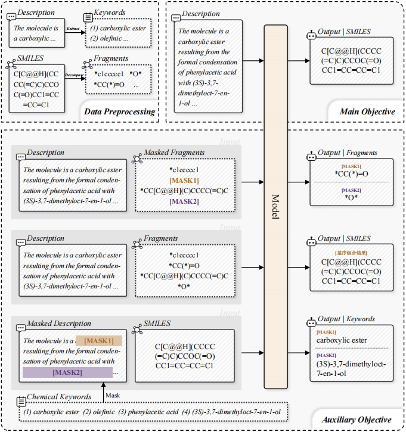

# MoGL



## Install

Clone this repository and install the required packages:

```bash
git clone https://github.com/MichaelKlausL/MoGL.git
cd MoGL

conda create -n mogl python=3.8 -y
conda activate mogl
pip install -r requirements.txt
```

## Weights

* TODO

## Dataset

The experiments are conducted on the ChEBI-20 dataset. Please download it from:

* [ChEBI-20](https://huggingface.co/datasets/liupf/ChEBI-20-MM)

For motif decomposition and chemical keyword extraction, please follow the [data preprocessing instructions](data_prepro/README_en.md).

## Train

Training configurations are provided in [`_yamls/Pretrain_Molfrag.yaml`](_yamls/Pretrain_Molfrag.yaml).

Text-guided molecule generation:

```bash
python main.py \
  --data_dir <your_data_path> \
  --task genmol
```

Molecule captioning:

```bash
python main.py \
  --data_dir <your_data_path> \
  --task gentext
```

## Evaluation

Text-guided molecule generation:

```bash
python eval.py \
  --data_dir <your_data_path> \
  --task genmol \
  --resume_from_checkpoint <checkpoint_path>
```

Molecule captioning:

```bash
python eval.py \
  --data_dir <your_data_path> \
  --task gentext \
  --resume_from_checkpoint <checkpoint_path>
```
